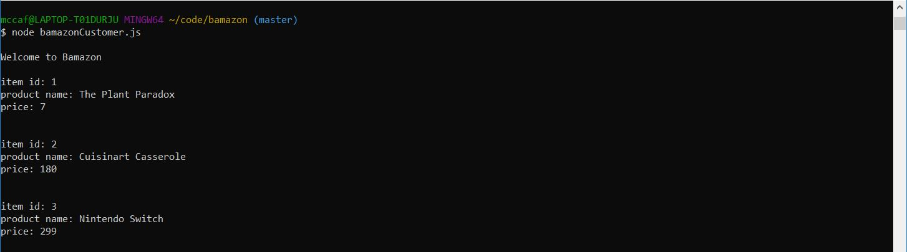
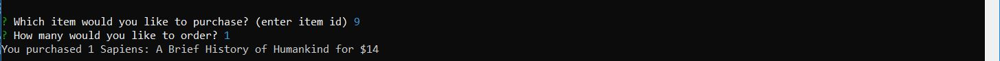
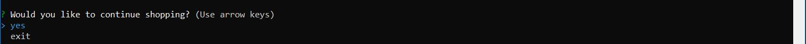

# bamazon

amazon-like storefront cli app using MySQL

## instructions

1. start the program by entering the cmd `node bamazonCustomer.js`
   - upon running the program will display all available items

2. once prompted enter the item id and quanitity to place an order

3. after placing an order either make another order or exit the program

